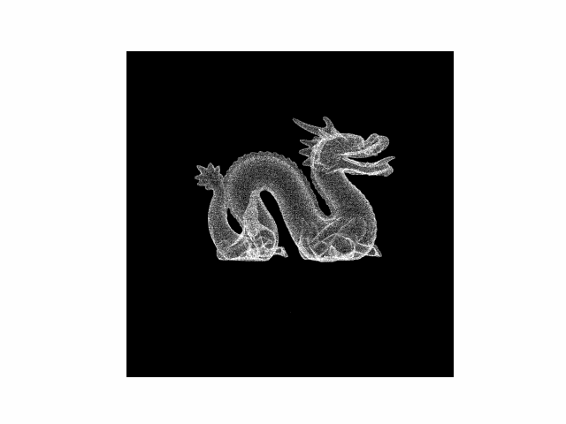

# Camera Geometry
Small, focused utilities for camera geometry with a strong pedantic emphasis on points, hyperplanes, projective spaces, transformations, homographies, image warpers, cameras, pointclouds, and a pointcloud viewer.

## Motivation
This project is a ground-up exercise in building computer vision notions: starting from NumPy-based vector spaces, defining elements and their spaces, with their core operations, and composing higher-level tools on top. In the future, I plan to explore different types of cameras, including multi-view cameras and algorithms.

## Requirements
- Python >= 3.12 (per `pyproject.toml`)
- NumPy, SciPy (installed via the steps below)

## Installation
Using `uv` (recommended):
```bash
uv pip install -e .
```

Using pip (editable install):
```bash
pip install -e .
```

## Quick start (geometry)
```python
import numpy as np
from camera_geometry.projective_space import ProjectivePoint, Hyperplane, ProjectiveSpace, Homography

# Points / planes in P^2
x1 = ProjectivePoint(np.array([1.0, 0.0, 1.0]))
x2 = ProjectivePoint(np.array([0.0, 1.0, 1.0]))
pi = Hyperplane.find_plane([x1, x2])
assert pi.contains(x1) and pi.contains(x2)

# Intersection of planes
p1 = Hyperplane(np.array([1.0, 0.0, -1.0]))
p2 = Hyperplane(np.array([0.0, 1.0, -1.0]))
x = ProjectivePoint.find_point([p1, p2])
assert p1.contains(x) and p2.contains(x)

# Projective space
P = ProjectiveSpace(dim=2)
affine = P.dehomogenize(ProjectivePoint(np.array([2.0, -3.0, 1.0])))

# Homography (must be square and non-singular)
H = Homography(np.array([
    [1.0, 1.0, 0.0],
    [0.0, 1.0, 0.0],
    [0.0, 0.0, 1.0],
]))
y = H(ProjectivePoint(np.array([1.0, 2.0, 1.0])))
```

### Quick start (image warper)
```python
import numpy as np
from camera_geometry.projective_space import Homography, ProjectivePoint
from camera_geometry.image_warper import ImageWarperNN

# Simple translation homography (shift right by 10 pixels, down by 5)
H = Homography(np.array([
    [1.0, 0.0, 10.0],
    [0.0, 1.0,  5.0],
    [0.0, 0.0,  1.0],
]))

img = np.arange(25, dtype=np.uint8).reshape(5, 5)
warper = ImageWarperNN(H)
warped = warper(img, background=0)
```

## Pointcloud viewer
```python
viewer = PointcloudViewer("pointcloud_file.ply")
viewer.show()
```



Controls:
- Arrows: translate camera in the image plane
- Mouse wheel: move forward/backward
- Left drag: arcball rotation (after clicking to anchor)
- Right click: pick anchor point on the rendered cloud